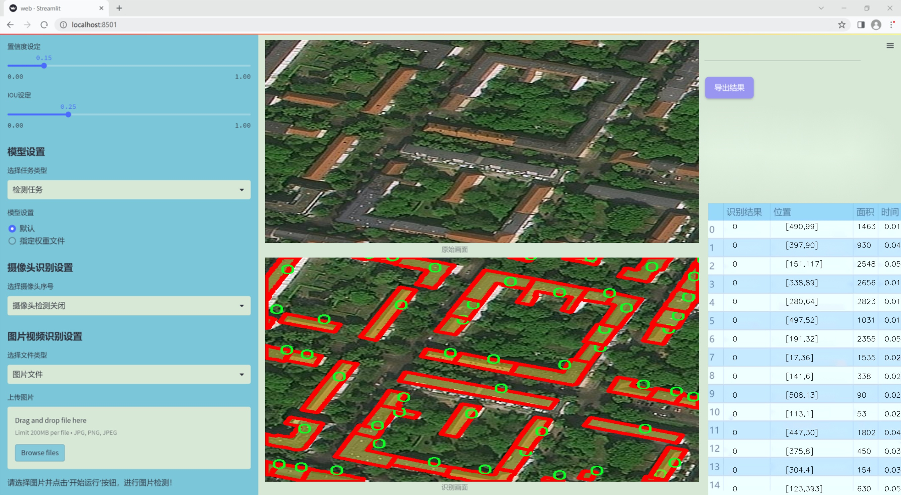
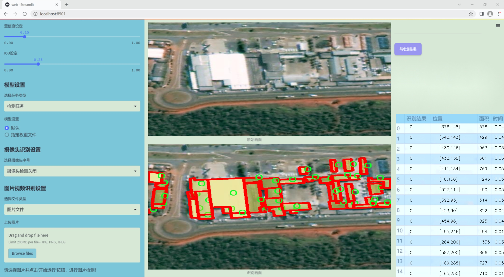
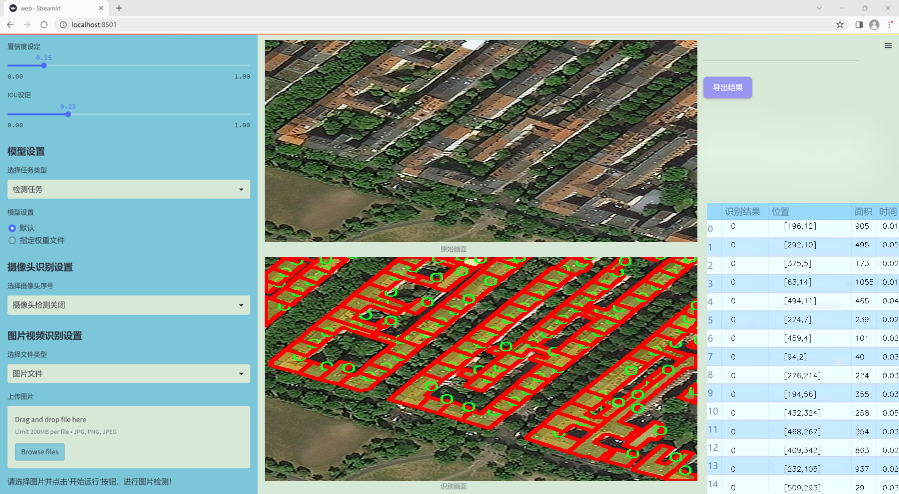
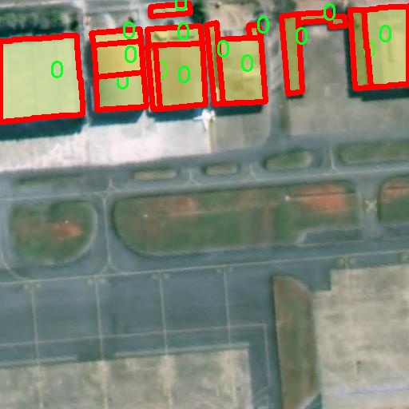
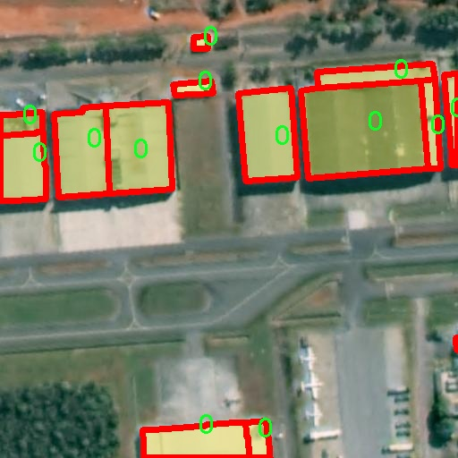
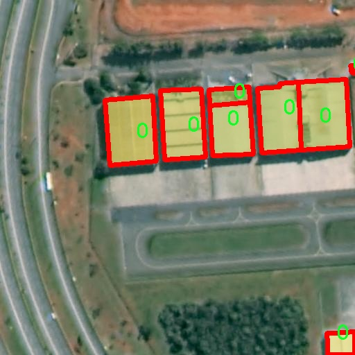
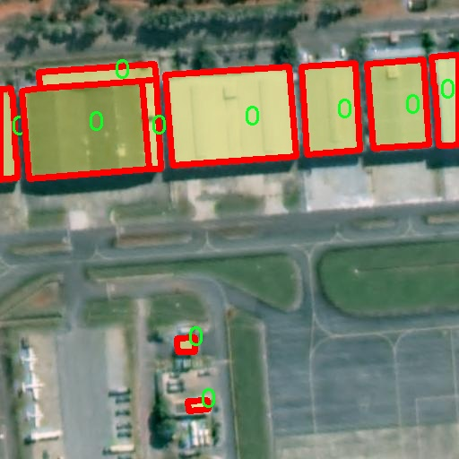
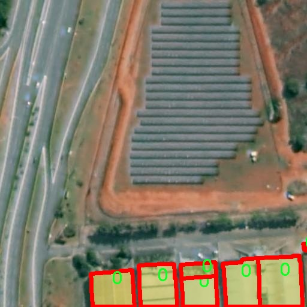

### 1.背景意义

研究背景与意义

随着城市化进程的加快，建筑物的数量和复杂性不断增加，建筑物实例分割技术在城市规划、建筑管理及安全监控等领域的重要性日益凸显。建筑物实例分割不仅能够精确识别和分离不同建筑物的轮廓，还能为后续的分析和决策提供重要的数据支持。传统的建筑物识别方法往往依赖于手工特征提取，效率低下且准确性不足，因此，基于深度学习的实例分割技术逐渐成为研究的热点。

YOLO（You Only Look Once）系列模型因其高效的实时检测能力和较好的准确性而受到广泛关注。YOLOv11作为该系列的最新版本，结合了更为先进的网络结构和训练策略，能够在保持高精度的同时，显著提高检测速度。通过对YOLOv11进行改进，构建一个专门针对建筑物实例分割的系统，将有助于提升建筑物识别的精度和效率。

本研究将利用DFC23数据集，该数据集包含1800张建筑物图像，涵盖了建筑物实例分割所需的基本信息。虽然该数据集的类别数量较少，仅有一个类别，但其图像的多样性和真实场景的代表性为模型的训练提供了良好的基础。通过对该数据集的深入分析和处理，可以有效地提升模型在实际应用中的表现。

综上所述，基于改进YOLOv11的建筑物实例分割系统的研究，不仅具有重要的理论意义，还将为实际应用提供强有力的技术支持。通过该系统的构建与优化，将为城市管理、建筑安全监控等领域的智能化发展奠定基础，推动相关技术的进步与应用。

### 2.视频效果

[2.1 视频效果](https://www.bilibili.com/video/BV17iqzYGEBX/)

### 3.图片效果







##### [项目涉及的源码数据来源链接](https://kdocs.cn/l/cszuIiCKVNis)**

注意：本项目提供训练的数据集和训练教程,由于版本持续更新,暂不提供权重文件（best.pt）,请按照6.训练教程进行训练后实现上图演示的效果。

### 4.数据集信息

##### 4.1 本项目数据集类别数＆类别名

nc: 1
names: ['0']


该项目为【图像分割】数据集，请在【训练教程和Web端加载模型教程（第三步）】这一步的时候按照【图像分割】部分的教程来训练

##### 4.2 本项目数据集信息介绍

本项目数据集信息介绍

本项目旨在改进YOLOv11的建筑物实例分割系统，所使用的数据集以“DFC23”为主题，专注于建筑物的检测与分割。该数据集包含丰富的建筑物图像，涵盖了多种不同的建筑风格和结构，提供了一个理想的训练基础，以提高模型在实际应用中的准确性和鲁棒性。数据集的设计考虑到了建筑物在不同环境和光照条件下的表现，确保模型能够在多样化的场景中进行有效的实例分割。

在数据集的类别设置上，DFC23数据集包含1个类别，类别名称为“0”，这一设计简化了模型的训练过程，使其能够专注于建筑物的特征提取与分割。尽管类别数量较少，但通过精心挑选和标注的图像，数据集依然能够提供足够的多样性，以帮助模型学习到建筑物的不同形态、纹理和边界特征。每幅图像都经过严格的标注，确保分割的准确性，为模型提供了高质量的训练样本。

为了进一步提升模型的性能，数据集还包含了不同分辨率和视角的图像，涵盖了城市建筑、乡村建筑以及特殊结构等多种类型。这种多样性不仅增强了模型的泛化能力，还使其能够适应不同的应用场景，如城市规划、建筑监测和智能交通系统等。通过对DFC23数据集的深入挖掘与分析，本项目希望能够推动建筑物实例分割技术的发展，为相关领域的研究和应用提供有力支持。











### 5.全套项目环境部署视频教程（零基础手把手教学）

[5.1 所需软件PyCharm和Anaconda安装教程（第一步）](https://www.bilibili.com/video/BV1BoC1YCEKi/?spm_id_from=333.999.0.0&vd_source=bc9aec86d164b67a7004b996143742dc)


[5.2 安装Python虚拟环境创建和依赖库安装视频教程（第二步）](https://www.bilibili.com/video/BV1ZoC1YCEBw?spm_id_from=333.788.videopod.sections&vd_source=bc9aec86d164b67a7004b996143742dc)

### 6.改进YOLOv11训练教程和Web_UI前端加载模型教程（零基础手把手教学）

[6.1 改进YOLOv11训练教程和Web_UI前端加载模型教程（第三步）](https://www.bilibili.com/video/BV1BoC1YCEhR?spm_id_from=333.788.videopod.sections&vd_source=bc9aec86d164b67a7004b996143742dc)


按照上面的训练视频教程链接加载项目提供的数据集，运行train.py即可开始训练



     Epoch   gpu_mem       box       obj       cls    labels  img_size
     1/200     20.8G   0.01576   0.01955  0.007536        22      1280: 100%|██████████| 849/849 [14:42<00:00,  1.04s/it]
               Class     Images     Labels          P          R     mAP@.5 mAP@.5:.95: 100%|██████████| 213/213 [01:14<00:00,  2.87it/s]
                 all       3395      17314      0.994      0.957      0.0957      0.0843

     Epoch   gpu_mem       box       obj       cls    labels  img_size
     2/200     20.8G   0.01578   0.01923  0.007006        22      1280: 100%|██████████| 849/849 [14:44<00:00,  1.04s/it]
               Class     Images     Labels          P          R     mAP@.5 mAP@.5:.95: 100%|██████████| 213/213 [01:12<00:00,  2.95it/s]
                 all       3395      17314      0.996      0.956      0.0957      0.0845

     Epoch   gpu_mem       box       obj       cls    labels  img_size
     3/200     20.8G   0.01561    0.0191  0.006895        27      1280: 100%|██████████| 849/849 [10:56<00:00,  1.29it/s]
               Class     Images     Labels          P          R     mAP@.5 mAP@.5:.95: 100%|███████   | 187/213 [00:52<00:00,  4.04it/s]
                 all       3395      17314      0.996      0.957      0.0957      0.0845


###### [项目数据集下载链接](https://kdocs.cn/l/cszuIiCKVNis)

### 7.原始YOLOv11算法讲解

YOLO11采用改进的骨干和颈部架构，增强了特征提取能力，提高了物体检测的精确度和复杂任务的表现。YOLO11引入精炼的架构设计和优化的训练流程，实现更快的处理速度，同时保持精度和性能之间的最佳平衡。通过模型设计的进步，YOLO11m在COCO数据集上实现了更高的均值平均精度（mAP），同时使用比YOLOv8m少22%的参数，使其在不妥协准确性的情况下更加计算高效。YOLO11可以无缝部署在各种环境中，包括边缘设备、云平台以及支持NVIDIA
GPU的系统，确保最大灵活性。无论是物体检测、实例分割、图像分类、姿态估计，还是定向物体检测（OBB），YOLO11都旨在应对多样的计算机视觉挑战。


##### **Ultralytics YOLO11相比于之前版本的主要改进有哪些？**

Ultralytics YOLO11在其前身基础上引入了几项重要进步。主要改进包括：

  1. **增强的特征提取** ：YOLO11采用改进的骨干和颈部架构，增强了特征提取能力，提高了物体检测的精确度。
  2.  **优化的效率和速度** ：精炼的架构设计和优化的训练流程实现了更快的处理速度，同时保持了准确性和性能之间的平衡。
  3.  **更高的准确性与更少的参数** ：YOLO11m在COCO数据集上实现了更高的均值平均精度（mAP），同时使用比YOLOv8m少22%的参数，使其在不妥协准确性的情况下更加计算高效。
  4.  **环境适应性强** ：YOLO11可以在多种环境中部署，包括边缘设备、云平台以及支持NVIDIA GPU的系统。
  5.  **支持广泛的任务** ：YOLO11支持多种计算机视觉任务，如物体检测、实例分割、图像分类、姿态估计和定向物体检测（OBB）。

我们先来看一下其网络结构有什么变化，可以看出，相比较于YOLOv8模型，其将CF2模块改成C3K2，同时在SPPF模块后面添加了一个C2PSA模块，且将YOLOv10的head思想引入到YOLO11的head中，使用深度可分离的方法，减少冗余计算，提高效率。下面我们来详细看一下这两个模块的结构是怎么构成的，以及它们为什么要这样设计


##### C3K2的网络结构

从下面图中我们可以看到，C3K2模块其实就是C2F模块转变出来的，它代码中有一个设置，就是当c3k这个参数为FALSE的时候，C3K2模块就是C2F模块，也就是说它的Bottleneck是普通的Bottleneck；反之当它为true的时候，将Bottleneck模块替换成C3模块。


##### C2PSA的网络结构

` `C2PSA是对 `C2f` 模块的扩展，它结合了PSA(Pointwise Spatial
Attention)块，用于增强特征提取和注意力机制。通过在标准 `C2f` 模块中引入 PSA
块，C2PSA实现了更强大的注意力机制，从而提高了模型对重要特征的捕捉能力。


##### **C2f 模块回顾：**

**** C2f模块是一个更快的 CSP（Cross Stage Partial）瓶颈实现，它通过两个卷积层和多个 Bottleneck
块进行特征提取。相比传统的 CSPNet，C2f 优化了瓶颈层的结构，使得计算速度更快。在 C2f中，`cv1` 是第一个 1x1
卷积，用于减少通道数；`cv2` 是另一个 1x1 卷积，用于恢复输出通道数。而 `n` 是一个包含 Bottleneck 块的数量，用于提取特征。

##### **C2PSA 模块的增强** ：

**C2PSA** 扩展了 C2f，通过引入PSA( **Position-Sensitive Attention)**
，旨在通过多头注意力机制和前馈神经网络来增强特征提取能力。它可以选择性地添加残差结构（shortcut）以优化梯度传播和网络训练效果。同时，使用FFN
可以将输入特征映射到更高维的空间，捕获输入特征的复杂非线性关系，允许模型学习更丰富的特征表示。

##### head部分

YOLO11在head部分的cls分支上使用深度可分离卷积 ，具体代码如下，cv2边界框回归分支，cv3分类分支。

    
    
     self.cv2 = nn.ModuleList(
                nn.Sequential(Conv(x, c2, 3), Conv(c2, c2, 3), nn.Conv2d(c2, 4 * self.reg_max, 1)) for x in ch
            )
            self.cv3 = nn.ModuleList(
                nn.Sequential(
                    nn.Sequential(DWConv(x, x, 3), Conv(x, c3, 1)),
                    nn.Sequential(DWConv(c3, c3, 3), Conv(c3, c3, 1)),
                    nn.Conv2d(c3, self.nc, 1),
                )
                for x in ch
            )


### 8.200+种全套改进YOLOV11创新点原理讲解

#### 8.1 200+种全套改进YOLOV11创新点原理讲解大全

由于篇幅限制，每个创新点的具体原理讲解就不全部展开，具体见下列网址中的改进模块对应项目的技术原理博客网址【Blog】（创新点均为模块化搭建，原理适配YOLOv5~YOLOv11等各种版本）

[改进模块技术原理博客【Blog】网址链接](https://gitee.com/qunmasj/good)


#### 8.2 精选部分改进YOLOV11创新点原理讲解

###### 这里节选部分改进创新点展开原理讲解(完整的改进原理见上图和[改进模块技术原理博客链接](https://gitee.com/qunmasj/good)【如果此小节的图加载失败可以通过CSDN或者Github搜索该博客的标题访问原始博客，原始博客图片显示正常】

### Gold-YOLO


#### Preliminaries
YOLO系列的中间层结构采用了传统的FPN结构，其中包含多个分支用于多尺度特征融合。然而，它只充分融合来自相邻级别的特征，对于其他层次的信息只能间接地进行“递归”获取。

传统的FPN结构在信息传输过程中存在丢失大量信息的问题。这是因为层之间的信息交互仅限于中间层选择的信息，未被选择的信息在传输过程中被丢弃。这种情况导致某个Level的信息只能充分辅助相邻层，而对其他全局层的帮助较弱。因此，整体上信息融合的有效性可能受到限制。
为了避免在传输过程中丢失信息，本文采用了一种新颖的“聚集和分发”机制（GD），放弃了原始的递归方法。该机制使用一个统一的模块来收集和融合所有Level的信息，并将其分发到不同的Level。通过这种方式，作者不仅避免了传统FPN结构固有的信息丢失问题，还增强了中间层的部分信息融合能力，而且并没有显著增加延迟。


#### 低阶聚合和分发分支 Low-stage gather-and-distribute branch
从主干网络中选择输出的B2、B3、B4、B5特征进行融合，以获取保留小目标信息的高分辨率特征。


#### 高阶聚合和分发分支 High-stage gather-and-distribute branch
高级全局特征对齐模块（High-GD）将由低级全局特征对齐模块（Low-GD）生成的特征{P3, P4, P5}进行融合。


Transformer融合模块由多个堆叠的transformer组成，transformer块的数量为L。每个transformer块包括一个多头注意力块、一个前馈网络（FFN）和残差连接。采用与LeViT相同的设置来配置多头注意力块，使用16个通道作为键K和查询Q的头维度，32个通道作为值V的头维度。为了加速推理过程，将层归一化操作替换为批归一化，并将所有的GELU激活函数替换为ReLU。为了增强变换器块的局部连接，在两个1x1卷积层之间添加了一个深度卷积层。同时，将FFN的扩展因子设置为2，以在速度和计算成本之间取得平衡。


信息注入模块(Information injection module)： 高级全局特征对齐模块（High-GD）中的信息注入模块与低级全局特征对齐模块（Low-GD）中的相同。在高级阶段，局部特征（Flocal）等于Pi，因此公式如下所示：


#### 增强的跨层信息流动 Enhanced cross-layer information flow
为了进一步提升性能，从YOLOv6 中的PAFPN模块中得到启发，引入了Inject-LAF模块。该模块是注入模块的增强版，包括了一个轻量级相邻层融合（LAF）模块，该模块被添加到注入模块的输入位置。为了在速度和准确性之间取得平衡，设计了两个LAF模型：LAF低级模型和LAF高级模型，分别用于低级注入（合并相邻两层的特征）和高级注入（合并相邻一层的特征）。它们的结构如图5(b)所示。为了确保来自不同层级的特征图与目标大小对齐，在实现中的两个LAF模型仅使用了三个操作符：双线性插值（上采样过小的特征）、平均池化（下采样过大的特征）和1x1卷积（调整与目标通道不同的特征）。模型中的LAF模块与信息注入模块的结合有效地平衡了准确性和速度之间的关系。通过使用简化的操作，能够增加不同层级之间的信息流路径数量，从而提高性能而不显著增加延迟。


### 9.系统功能展示

图9.1.系统支持检测结果表格显示

  图9.2.系统支持置信度和IOU阈值手动调节

  图9.3.系统支持自定义加载权重文件best.pt(需要你通过步骤5中训练获得)

  图9.4.系统支持摄像头实时识别

  图9.5.系统支持图片识别

  图9.6.系统支持视频识别

  图9.7.系统支持识别结果文件自动保存

  图9.8.系统支持Excel导出检测结果数据


### 10. YOLOv11核心改进源码讲解

#### 10.1 fast_kan_conv.py

以下是经过精简和注释的核心代码，保留了主要的功能和结构：

```python
import torch
import torch.nn as nn

# 定义径向基函数（Radial Basis Function）类
class RadialBasisFunction(nn.Module):
    def __init__(self, grid_min: float = -2., grid_max: float = 2., num_grids: int = 8, denominator: float = None):
        super().__init__()
        # 创建一个线性空间的网格
        grid = torch.linspace(grid_min, grid_max, num_grids)
        self.grid = torch.nn.Parameter(grid, requires_grad=False)  # 将网格参数化，不需要梯度
        self.denominator = denominator or (grid_max - grid_min) / (num_grids - 1)  # 计算分母

    def forward(self, x):
        # 计算径向基函数的输出
        return torch.exp(-((x[..., None] - self.grid) / self.denominator) ** 2)

# 定义FastKAN卷积层的基类
class FastKANConvNDLayer(nn.Module):
    def __init__(self, conv_class, norm_class, input_dim, output_dim, kernel_size, groups=1, padding=0, stride=1, dilation=1, ndim: int = 2, grid_size=8, base_activation=nn.SiLU, grid_range=[-2, 2], dropout=0.0):
        super(FastKANConvNDLayer, self).__init__()
        # 初始化参数
        self.inputdim = input_dim
        self.outdim = output_dim
        self.kernel_size = kernel_size
        self.padding = padding
        self.stride = stride
        self.dilation = dilation
        self.groups = groups
        self.ndim = ndim
        self.grid_size = grid_size
        self.base_activation = base_activation()  # 基础激活函数
        self.grid_range = grid_range

        # 验证参数的有效性
        if groups <= 0:
            raise ValueError('groups must be a positive integer')
        if input_dim % groups != 0:
            raise ValueError('input_dim must be divisible by groups')
        if output_dim % groups != 0:
            raise ValueError('output_dim must be divisible by groups')

        # 创建基础卷积层和样条卷积层
        self.base_conv = nn.ModuleList([conv_class(input_dim // groups, output_dim // groups, kernel_size, stride, padding, dilation, groups=1, bias=False) for _ in range(groups)])
        self.spline_conv = nn.ModuleList([conv_class(grid_size * input_dim // groups, output_dim // groups, kernel_size, stride, padding, dilation, groups=1, bias=False) for _ in range(groups)])
        self.layer_norm = nn.ModuleList([norm_class(output_dim // groups) for _ in range(groups)])  # 归一化层

        # 创建径向基函数实例
        self.rbf = RadialBasisFunction(grid_range[0], grid_range[1], grid_size)

        # 初始化丢弃层
        self.dropout = nn.Dropout(p=dropout) if dropout > 0 else None

        # 使用Kaiming均匀分布初始化卷积层权重
        for conv_layer in self.base_conv:
            nn.init.kaiming_uniform_(conv_layer.weight, nonlinearity='linear')
        for conv_layer in self.spline_conv:
            nn.init.kaiming_uniform_(conv_layer.weight, nonlinearity='linear')

    def forward_fast_kan(self, x, group_index):
        # 对输入应用基础激活函数并进行线性变换
        base_output = self.base_conv[group_index](self.base_activation(x))
        if self.dropout is not None:
            x = self.dropout(x)  # 应用丢弃层
        spline_basis = self.rbf(self.layer_norm[group_index](x))  # 计算样条基
        spline_basis = spline_basis.moveaxis(-1, 2).flatten(1, 2)  # 调整维度
        spline_output = self.spline_conv[group_index](spline_basis)  # 计算样条卷积输出
        x = base_output + spline_output  # 合并基础输出和样条输出

        return x

    def forward(self, x):
        # 将输入按组分割
        split_x = torch.split(x, self.inputdim // self.groups, dim=1)
        output = []
        for group_ind, _x in enumerate(split_x):
            y = self.forward_fast_kan(_x.clone(), group_ind)  # 处理每一组
            output.append(y.clone())
        y = torch.cat(output, dim=1)  # 合并所有组的输出
        return y

# 定义不同维度的FastKAN卷积层
class FastKANConv3DLayer(FastKANConvNDLayer):
    def __init__(self, input_dim, output_dim, kernel_size, groups=1, padding=0, stride=1, dilation=1, grid_size=8, base_activation=nn.SiLU, grid_range=[-2, 2], dropout=0.0):
        super(FastKANConv3DLayer, self).__init__(nn.Conv3d, nn.InstanceNorm3d, input_dim, output_dim, kernel_size, groups=groups, padding=padding, stride=stride, dilation=dilation, ndim=3, grid_size=grid_size, base_activation=base_activation, grid_range=grid_range, dropout=dropout)

class FastKANConv2DLayer(FastKANConvNDLayer):
    def __init__(self, input_dim, output_dim, kernel_size, groups=1, padding=0, stride=1, dilation=1, grid_size=8, base_activation=nn.SiLU, grid_range=[-2, 2], dropout=0.0):
        super(FastKANConv2DLayer, self).__init__(nn.Conv2d, nn.InstanceNorm2d, input_dim, output_dim, kernel_size, groups=groups, padding=padding, stride=stride, dilation=dilation, ndim=2, grid_size=grid_size, base_activation=base_activation, grid_range=grid_range, dropout=dropout)

class FastKANConv1DLayer(FastKANConvNDLayer):
    def __init__(self, input_dim, output_dim, kernel_size, groups=1, padding=0, stride=1, dilation=1, grid_size=8, base_activation=nn.SiLU, grid_range=[-2, 2], dropout=0.0):
        super(FastKANConv1DLayer, self).__init__(nn.Conv1d, nn.InstanceNorm1d, input_dim, output_dim, kernel_size, groups=groups, padding=padding, stride=stride, dilation=dilation, ndim=1, grid_size=grid_size, base_activation=base_activation, grid_range=grid_range, dropout=dropout)
```

### 代码说明：
1. **RadialBasisFunction**: 该类实现了径向基函数，主要用于计算输入与预定义网格之间的距离，返回相应的基函数值。
2. **FastKANConvNDLayer**: 这是一个通用的卷积层基类，支持多维卷积。它包括基础卷积、样条卷积、归一化层和径向基函数。该类的`forward`方法实现了对输入的分组处理和卷积操作。
3. **FastKANConv1DLayer、FastKANConv2DLayer、FastKANConv3DLayer**: 这些类分别继承自`FastKANConvNDLayer`，用于实现1D、2D和3D卷积操作，便于用户根据需求选择合适的卷积层。

代码中的注释详细解释了每个部分的功能和目的，帮助理解其工作原理。

这个程序文件定义了一个用于快速卷积操作的深度学习模块，主要包括了一个径向基函数（Radial Basis Function）和一个快速KAN卷积层（FastKANConvNDLayer），并且为一维、二维和三维卷积提供了特定的实现类。

首先，`RadialBasisFunction`类是一个自定义的神经网络模块，初始化时接收一些参数，包括网格的最小值和最大值、网格的数量以及分母。这个类的作用是生成一个径向基函数，具体实现是通过计算输入值与网格之间的距离，并通过指数函数将其转换为平滑的输出。这个输出在后续的卷积操作中会被使用。

接下来，`FastKANConvNDLayer`类是核心卷积层的实现。它继承自`nn.Module`，并在初始化时接收多个参数，如输入和输出维度、卷积核大小、分组数、填充、步幅、扩张、维度数、网格大小、基础激活函数、网格范围和丢弃率等。这个类首先会检查输入的有效性，比如分组数必须是正整数，并且输入和输出维度必须能被分组数整除。

在初始化过程中，`FastKANConvNDLayer`创建了多个基础卷积层和样条卷积层（spline convolution layers），并为每个组分配了归一化层。它还实例化了一个径向基函数对象。为了提高训练的初始效果，所有卷积层的权重使用Kaiming均匀分布进行初始化。

`forward_fast_kan`方法是该类的前向传播实现，首先对输入应用基础激活函数，然后通过基础卷积层进行线性变换。接着，如果设置了丢弃率，则对输入进行丢弃操作。然后，输入经过归一化处理后传入径向基函数，生成样条基。样条基被调整维度后传入样条卷积层，最后将基础卷积的输出与样条卷积的输出相加，得到最终的输出。

`forward`方法则是对输入进行分组处理，分别调用`forward_fast_kan`方法处理每个组的输入，最后将所有组的输出拼接在一起。

最后，`FastKANConv3DLayer`、`FastKANConv2DLayer`和`FastKANConv1DLayer`类分别是针对三维、二维和一维卷积的特定实现，它们都继承自`FastKANConvNDLayer`，并在初始化时指定了对应的卷积和归一化类。

整体来看，这个文件实现了一个灵活且高效的卷积层，结合了径向基函数和样条卷积的优点，适用于不同维度的输入数据。

#### 10.2 test_selective_scan.py

以下是代码中最核心的部分，并附上详细的中文注释：

```python
import torch
import torch.nn.functional as F

def build_selective_scan_fn(selective_scan_cuda: object = None, mode="mamba_ssm", tag=None):
    """
    构建选择性扫描函数，使用指定的CUDA实现。
    
    参数:
    selective_scan_cuda: CUDA实现的选择性扫描函数
    mode: 模式选择
    tag: 标签，用于表示当前模式
    
    返回:
    selective_scan_fn: 构建的选择性扫描函数
    """
    
    class SelectiveScanFn(torch.autograd.Function):
        @staticmethod
        def forward(ctx, u, delta, A, B, C, D=None, z=None, delta_bias=None, delta_softplus=False, return_last_state=False, nrows=1, backnrows=-1):
            """
            前向传播函数，执行选择性扫描操作。
            
            参数:
            ctx: 上下文对象，用于保存状态
            u: 输入张量
            delta: 变化率张量
            A, B, C: 权重张量
            D: 可选的偏置张量
            z: 可选的门控张量
            delta_bias: 可选的变化率偏置
            delta_softplus: 是否使用softplus激活
            return_last_state: 是否返回最后状态
            nrows: 行数
            backnrows: 反向传播的行数
            
            返回:
            out: 输出张量
            last_state: 最后状态（可选）
            """
            # 确保输入张量是连续的
            if u.stride(-1) != 1:
                u = u.contiguous()
            if delta.stride(-1) != 1:
                delta = delta.contiguous()
            if D is not None:
                D = D.contiguous()
            if B.stride(-1) != 1:
                B = B.contiguous()
            if C.stride(-1) != 1:
                C = C.contiguous()
            if z is not None and z.stride(-1) != 1:
                z = z.contiguous()

            # 检查输入的形状是否符合要求
            assert u.shape[1] % (B.shape[1] * nrows) == 0 
            assert nrows in [1, 2, 3, 4] 

            # 选择不同的CUDA实现
            if mode == "mamba_ssm":
                out, x, *rest = selective_scan_cuda.fwd(u, delta, A, B, C, D, z, delta_bias, delta_softplus)
            else:
                raise NotImplementedError("未实现的模式")

            # 保存状态以供反向传播使用
            ctx.save_for_backward(u, delta, A, B, C, D, delta_bias, x)
            last_state = x[:, :, -1, 1::2]  # 获取最后状态
            return out if not return_last_state else (out, last_state)

        @staticmethod
        def backward(ctx, dout):
            """
            反向传播函数，计算梯度。
            
            参数:
            ctx: 上下文对象
            dout: 输出的梯度
            
            返回:
            梯度
            """
            u, delta, A, B, C, D, delta_bias, x = ctx.saved_tensors
            
            # 调用CUDA实现的反向传播
            du, ddelta, dA, dB, dC, dD, ddelta_bias, *rest = selective_scan_cuda.bwd(
                u, delta, A, B, C, D, delta_bias, dout, x, None, False
            )

            return (du, ddelta, dA, dB, dC, dD if D is not None else None, None, ddelta_bias if delta_bias is not None else None)

    def selective_scan_fn(u, delta, A, B, C, D=None, z=None, delta_bias=None, delta_softplus=False, return_last_state=False, nrows=1, backnrows=-1):
        """
        封装选择性扫描函数，调用前向传播。
        
        参数:
        同上
        
        返回:
        同上
        """
        return SelectiveScanFn.apply(u, delta, A, B, C, D, z, delta_bias, delta_softplus, return_last_state, nrows, backnrows)

    return selective_scan_fn

# 选择性扫描函数的使用示例
selective_scan_fn = build_selective_scan_fn(selective_scan_cuda=None, mode="mamba_ssm")
```

### 代码核心部分说明：
1. **build_selective_scan_fn**: 该函数用于构建选择性扫描的前向和反向传播函数。它接收一个CUDA实现和模式参数，并返回一个可以直接调用的选择性扫描函数。

2. **SelectiveScanFn**: 这是一个自定义的PyTorch自动求导函数，包含前向和反向传播的实现。前向传播执行选择性扫描操作，反向传播计算梯度。

3. **forward**: 前向传播函数，执行主要的计算逻辑，包括输入张量的处理、选择CUDA实现的调用以及状态的保存。

4. **backward**: 反向传播函数，计算输入张量的梯度，并返回这些梯度。

5. **selective_scan_fn**: 封装的选择性扫描函数，简化了调用过程。

通过这些核心部分，用户可以利用选择性扫描功能进行高效的张量计算。

这个程序文件 `test_selective_scan.py` 是一个用于测试选择性扫描（Selective Scan）操作的 PyTorch 实现。文件中包含了选择性扫描的前向和反向传播函数的定义，以及一系列的测试用例，旨在验证不同配置下选择性扫描的正确性和性能。

首先，程序导入了必要的库，包括 PyTorch、Einops、时间处理和函数式编程工具。然后定义了一个构建选择性扫描函数的辅助函数 `build_selective_scan_fn`，该函数接受一个 CUDA 实现和模式参数，返回一个自定义的 PyTorch 函数类 `SelectiveScanFn`。

在 `SelectiveScanFn` 类中，定义了前向传播 `forward` 和反向传播 `backward` 方法。前向传播方法中首先确保输入张量是连续的，并根据输入的维度和形状进行必要的调整。然后，根据不同的模式调用相应的 CUDA 实现进行计算，最后保存必要的上下文信息以供反向传播使用。反向传播方法则根据保存的上下文计算梯度，并返回相应的梯度信息。

文件中还定义了两个参考实现 `selective_scan_ref` 和 `selective_scan_ref_v2`，这些实现是基于 PyTorch 的张量操作，用于验证 CUDA 实现的正确性。这些参考实现接受与选择性扫描相同的输入参数，并返回计算结果。

接下来，程序根据不同的模式导入相应的 CUDA 实现，并构建选择性扫描函数。模式的选择可以影响计算的效率和结果的准确性。

最后，使用 pytest 框架定义了一系列的测试用例 `test_selective_scan`，这些测试用例通过参数化的方式覆盖了多种输入配置，包括数据类型、序列长度、是否使用偏置等。测试中生成随机输入数据，并调用选择性扫描函数和参考实现进行比较，确保它们的输出在可接受的误差范围内。同时，还对反向传播计算的梯度进行验证，确保自定义实现与参考实现的一致性。

总体而言，这个程序文件是一个完整的选择性扫描操作的实现与测试框架，展示了如何在 PyTorch 中构建自定义的高效计算图，并通过严格的测试确保其正确性。

#### 10.3 fasternet.py

以下是代码中最核心的部分，并附上详细的中文注释：

```python
import torch
import torch.nn as nn
from typing import List
from torch import Tensor

class Partial_conv3(nn.Module):
    """
    部分卷积层，用于处理输入特征图的不同部分。
    """
    def __init__(self, dim, n_div, forward):
        super().__init__()
        self.dim_conv3 = dim // n_div  # 计算部分卷积的维度
        self.dim_untouched = dim - self.dim_conv3  # 计算未处理部分的维度
        self.partial_conv3 = nn.Conv2d(self.dim_conv3, self.dim_conv3, 3, 1, 1, bias=False)  # 定义卷积层

        # 根据前向传播方式选择相应的前向传播函数
        if forward == 'slicing':
            self.forward = self.forward_slicing
        elif forward == 'split_cat':
            self.forward = self.forward_split_cat
        else:
            raise NotImplementedError

    def forward_slicing(self, x: Tensor) -> Tensor:
        # 仅用于推理阶段
        x = x.clone()  # 克隆输入以保持原始输入不变
        x[:, :self.dim_conv3, :, :] = self.partial_conv3(x[:, :self.dim_conv3, :, :])  # 处理部分特征图
        return x

    def forward_split_cat(self, x: Tensor) -> Tensor:
        # 用于训练和推理阶段
        x1, x2 = torch.split(x, [self.dim_conv3, self.dim_untouched], dim=1)  # 将输入分为两部分
        x1 = self.partial_conv3(x1)  # 处理第一部分
        x = torch.cat((x1, x2), 1)  # 将处理后的部分与未处理部分拼接
        return x


class MLPBlock(nn.Module):
    """
    多层感知机块，包含卷积层、归一化层和激活函数。
    """
    def __init__(self, dim, n_div, mlp_ratio, drop_path, layer_scale_init_value, act_layer, norm_layer, pconv_fw_type):
        super().__init__()
        self.dim = dim
        self.mlp_ratio = mlp_ratio
        self.drop_path = nn.Identity() if drop_path <= 0 else DropPath(drop_path)  # 根据drop_path的值选择是否使用DropPath
        self.n_div = n_div

        mlp_hidden_dim = int(dim * mlp_ratio)  # 计算隐藏层维度

        # 定义多层感知机的结构
        mlp_layer: List[nn.Module] = [
            nn.Conv2d(dim, mlp_hidden_dim, 1, bias=False),
            norm_layer(mlp_hidden_dim),
            act_layer(),
            nn.Conv2d(mlp_hidden_dim, dim, 1, bias=False)
        ]

        self.mlp = nn.Sequential(*mlp_layer)  # 将层组合成一个顺序容器

        # 初始化空间混合层
        self.spatial_mixing = Partial_conv3(dim, n_div, pconv_fw_type)

    def forward(self, x: Tensor) -> Tensor:
        shortcut = x  # 保存输入以便于残差连接
        x = self.spatial_mixing(x)  # 进行空间混合
        x = shortcut + self.drop_path(self.mlp(x))  # 残差连接
        return x


class FasterNet(nn.Module):
    """
    FasterNet模型的主类，包含多个阶段和特征提取模块。
    """
    def __init__(self, in_chans=3, num_classes=1000, embed_dim=96, depths=(1, 2, 8, 2), mlp_ratio=2., n_div=4,
                 patch_size=4, patch_stride=4, patch_size2=2, patch_stride2=2, patch_norm=True, drop_path_rate=0.1,
                 layer_scale_init_value=0, norm_layer='BN', act_layer='RELU', pconv_fw_type='split_cat'):
        super().__init__()

        # 选择归一化层和激活函数
        norm_layer = nn.BatchNorm2d if norm_layer == 'BN' else NotImplementedError
        act_layer = partial(nn.ReLU, inplace=True) if act_layer == 'RELU' else NotImplementedError

        self.num_stages = len(depths)  # 模型阶段数
        self.embed_dim = embed_dim  # 嵌入维度
        self.depths = depths  # 每个阶段的深度

        # 将输入图像分割为不重叠的补丁
        self.patch_embed = PatchEmbed(patch_size=patch_size, patch_stride=patch_stride, in_chans=in_chans,
                                      embed_dim=embed_dim, norm_layer=norm_layer if patch_norm else None)

        # 随机深度衰减规则
        dpr = [x.item() for x in torch.linspace(0, drop_path_rate, sum(depths))]

        # 构建各个阶段
        stages_list = []
        for i_stage in range(self.num_stages):
            stage = BasicStage(dim=int(embed_dim * 2 ** i_stage), n_div=n_div, depth=depths[i_stage],
                               mlp_ratio=mlp_ratio, drop_path=dpr[sum(depths[:i_stage]):sum(depths[:i_stage + 1])],
                               layer_scale_init_value=layer_scale_init_value, norm_layer=norm_layer,
                               act_layer=act_layer, pconv_fw_type=pconv_fw_type)
            stages_list.append(stage)

            # 添加补丁合并层
            if i_stage < self.num_stages - 1:
                stages_list.append(PatchMerging(patch_size2=patch_size2, patch_stride2=patch_stride2,
                                                 dim=int(embed_dim * 2 ** i_stage), norm_layer=norm_layer))

        self.stages = nn.Sequential(*stages_list)  # 将所有阶段组合成一个顺序容器

    def forward(self, x: Tensor) -> Tensor:
        # 输出四个阶段的特征用于密集预测
        x = self.patch_embed(x)  # 嵌入补丁
        outs = []
        for idx, stage in enumerate(self.stages):
            x = stage(x)  # 通过每个阶段
            if idx in self.out_indices:  # 如果当前阶段在输出索引中
                norm_layer = getattr(self, f'norm{idx}')  # 获取归一化层
                x_out = norm_layer(x)  # 应用归一化
                outs.append(x_out)  # 保存输出
        return outs
```

### 代码说明
1. **Partial_conv3**: 这个类实现了部分卷积，能够根据输入的不同部分进行处理，适用于推理和训练阶段。
2. **MLPBlock**: 这个类实现了多层感知机块，包含卷积、归一化和激活函数，支持残差连接。
3. **FasterNet**: 这是整个模型的核心类，负责构建网络的不同阶段，包括补丁嵌入和补丁合并。模型的前向传播过程将输入图像分割为补丁，并通过多个阶段进行特征提取。

通过这些核心部分，FasterNet模型能够有效地处理输入数据并提取特征，适用于各种计算机视觉任务。

这个程序文件 `fasternet.py` 实现了一个名为 FasterNet 的深度学习模型，主要用于图像处理任务。文件中包含了多个类和函数，构成了整个模型的结构和功能。

首先，程序导入了一些必要的库，包括 PyTorch、YAML 和一些深度学习相关的模块。接着，定义了多个类，每个类都有其特定的功能。

`Partial_conv3` 类实现了一个部分卷积层，可以根据不同的前向传播方式（切片或拼接）来处理输入数据。这个类在模型的前向传播中用于对输入特征图进行局部卷积操作。

`MLPBlock` 类定义了一个多层感知机（MLP）模块，包含了两个卷积层和一个激活函数。这个模块在前向传播中使用了残差连接，并且可以选择性地应用层缩放。

`BasicStage` 类则是由多个 `MLPBlock` 组成的一个阶段，负责处理输入数据并生成特征输出。

`PatchEmbed` 类用于将输入图像分割成不重叠的补丁，并通过卷积层进行嵌入。`PatchMerging` 类则用于将补丁合并，以减少特征图的尺寸。

`FasterNet` 类是整个模型的核心，包含了多个阶段的构建。它根据输入的参数配置（如嵌入维度、深度等）来初始化各个模块，并在前向传播中依次通过这些模块处理输入数据。该类还实现了输出多个阶段的特征，以便进行密集预测。

文件中还定义了一些辅助函数，如 `update_weight` 用于更新模型权重，`fasternet_t0`、`fasternet_t1` 等函数用于加载不同配置的 FasterNet 模型。这些函数从 YAML 配置文件中读取模型参数，并根据需要加载预训练权重。

最后，在 `__main__` 块中，程序实例化了一个 FasterNet 模型，并对输入进行测试，输出了各个阶段的特征图的尺寸。

总体来说，这个程序实现了一个灵活且可配置的深度学习模型，适用于各种图像处理任务，并提供了加载和更新模型权重的功能。

#### 10.4 dyhead_prune.py

以下是经过简化并添加详细中文注释的核心代码部分：

```python
import torch
import torch.nn as nn
import torch.nn.functional as F

class DyReLU(nn.Module):
    """
    动态ReLU激活函数模块，能够根据输入动态调整激活值。
    """
    def __init__(self, inp, reduction=4, lambda_a=1.0, use_bias=True):
        super(DyReLU, self).__init__()
        self.oup = inp  # 输出通道数
        self.lambda_a = lambda_a * 2  # 动态调整参数
        self.avg_pool = nn.AdaptiveAvgPool2d(1)  # 自适应平均池化层

        # 确定压缩比例
        squeeze = inp // reduction
        self.fc = nn.Sequential(
            nn.Linear(inp, squeeze),  # 全连接层，输入到压缩
            nn.ReLU(inplace=True),  # ReLU激活
            nn.Linear(squeeze, self.oup * 2),  # 输出到双倍的输出通道数
            h_sigmoid()  # 使用h_sigmoid激活
        )

    def forward(self, x):
        """
        前向传播函数
        :param x: 输入张量
        :return: 动态调整后的输出
        """
        b, c, h, w = x.size()  # 获取输入的批量大小、通道数、高度和宽度
        y = self.avg_pool(x).view(b, c)  # 对输入进行自适应平均池化
        y = self.fc(y).view(b, self.oup * 2, 1, 1)  # 通过全连接层处理并调整形状

        # 分割输出以获得动态参数
        a1, b1 = torch.split(y, self.oup, dim=1)
        a1 = (a1 - 0.5) * self.lambda_a + 1.0  # 动态调整参数
        out = x * a1 + b1  # 计算输出

        return out  # 返回动态调整后的输出

class DyDCNv2(nn.Module):
    """
    带有归一化层的Modulated Deformable Convolution模块。
    """
    def __init__(self, in_channels, out_channels, stride=1, norm_cfg=dict(type='GN', num_groups=16)):
        super().__init__()
        self.conv = ModulatedDeformConv2d(in_channels, out_channels, 3, stride=stride, padding=1)  # 可调变形卷积
        self.norm = build_norm_layer(norm_cfg, out_channels)[1] if norm_cfg else None  # 归一化层

    def forward(self, x, offset, mask):
        """
        前向传播函数
        :param x: 输入张量
        :param offset: 偏移量
        :param mask: 掩码
        :return: 经过卷积和归一化处理的输出
        """
        x = self.conv(x.contiguous(), offset, mask)  # 进行可调变形卷积
        if self.norm:
            x = self.norm(x)  # 如果有归一化层，则进行归一化
        return x  # 返回输出

class DyHeadBlock_Prune(nn.Module):
    """
    DyHead模块，包含三种类型的注意力机制。
    """
    def __init__(self, in_channels, norm_type='GN'):
        super().__init__()
        self.spatial_conv_high = DyDCNv2(in_channels, in_channels)  # 高层空间卷积
        self.spatial_conv_mid = DyDCNv2(in_channels, in_channels)  # 中层空间卷积
        self.spatial_conv_low = DyDCNv2(in_channels, in_channels, stride=2)  # 低层空间卷积
        self.spatial_conv_offset = nn.Conv2d(in_channels, 27, 3, padding=1)  # 偏移和掩码的卷积层
        self.task_attn_module = DyReLU(in_channels)  # 任务注意力模块

    def forward(self, x, level):
        """
        前向传播函数
        :param x: 输入特征图
        :param level: 当前特征图的层级
        :return: 经过注意力机制处理后的输出
        """
        offset_and_mask = self.spatial_conv_offset(x[level])  # 计算偏移和掩码
        offset = offset_and_mask[:, :18, :, :]  # 获取偏移量
        mask = offset_and_mask[:, 18:, :, :].sigmoid()  # 获取掩码并应用sigmoid

        mid_feat = self.spatial_conv_mid(x[level], offset, mask)  # 中层特征卷积
        sum_feat = mid_feat * self.scale_attn_module(mid_feat)  # 加权中层特征

        # 处理低层和高层特征
        if level > 0:
            low_feat = self.spatial_conv_low(x[level - 1], offset, mask)  # 低层特征卷积
            sum_feat += low_feat * self.scale_attn_module(low_feat)  # 加权低层特征
        if level < len(x) - 1:
            high_feat = F.interpolate(self.spatial_conv_high(x[level + 1], offset, mask), size=x[level].shape[-2:], mode='bilinear', align_corners=True)  # 高层特征卷积并上采样
            sum_feat += high_feat * self.scale_attn_module(high_feat)  # 加权高层特征

        return self.task_attn_module(sum_feat)  # 返回经过任务注意力模块处理后的输出
```

### 代码说明：
1. **DyReLU**: 这是一个动态激活函数模块，能够根据输入的特征动态调整激活值。它使用自适应平均池化和全连接层来生成动态参数。
  
2. **DyDCNv2**: 这是一个带有归一化层的可调变形卷积模块，使用偏移和掩码来调整卷积操作。它的前向传播函数接受输入特征、偏移量和掩码，并返回经过卷积和归一化处理的输出。

3. **DyHeadBlock_Prune**: 这是一个包含多种注意力机制的模块，使用不同层次的特征进行卷积和加权。它的前向传播函数计算偏移和掩码，并结合不同层次的特征进行加权处理，最终返回经过任务注意力模块处理后的输出。

这个程序文件 `dyhead_prune.py` 是一个基于 PyTorch 的深度学习模块，主要实现了动态头（Dynamic Head）的一些组件，特别是与动态卷积和注意力机制相关的部分。代码中包含了多个自定义的神经网络层和模块，下面是对代码的详细讲解。

首先，文件导入了必要的库，包括 PyTorch 的核心库和一些其他模块，如 `mmcv` 和 `mmengine`，这些库提供了构建神经网络所需的功能。接着，定义了一个 `_make_divisible` 函数，用于确保某个值可以被指定的除数整除，并且在必要时对其进行调整，以满足一定的最小值要求。

接下来，定义了几个激活函数类，包括 `swish`、`h_swish` 和 `h_sigmoid`。这些类继承自 `nn.Module`，并实现了各自的前向传播方法。`swish` 是一种新型激活函数，`h_swish` 和 `h_sigmoid` 则是与 ReLU 相关的变体，具有不同的非线性特性。

`DyReLU` 类是一个动态激活函数模块，它的设计允许根据输入的特征动态调整激活值。构造函数中包含了多个参数，如输入通道数、压缩比、是否使用偏置等。前向传播方法中，首先通过全局平均池化获取输入特征的统计信息，然后通过全连接层计算出动态的激活参数，最后根据这些参数对输入进行加权和偏置调整。

`DyDCNv2` 类实现了带有归一化层的可调变形卷积。该模块的构造函数接受输入和输出通道数、步幅以及归一化配置。前向传播方法中，首先执行变形卷积操作，然后如果需要的话，应用归一化层。

`DyHeadBlock_Prune` 类是动态头模块的一个实现，包含了三种类型的注意力机制。构造函数中定义了多个卷积层和注意力模块，包括空间卷积和任务注意力模块。初始化权重的方法 `_init_weights` 用于对卷积层的权重进行初始化。前向传播方法中，首先计算偏移量和掩码，然后通过不同层次的特征进行卷积操作，并结合注意力机制进行加权，最终输出经过任务注意力模块处理的特征。

整体来看，这个文件实现了一个复杂的动态卷积和注意力机制的组合，适用于需要多层次特征融合和动态调整的深度学习任务，如目标检测和图像分割等。通过这些模块的组合，可以有效提升模型在处理复杂任务时的表现。

### 11.完整训练+Web前端界面+200+种全套创新点源码、数据集获取


# [下载链接：https://mbd.pub/o/bread/Z5yZmpZr](https://mbd.pub/o/bread/Z5yZmpZr)